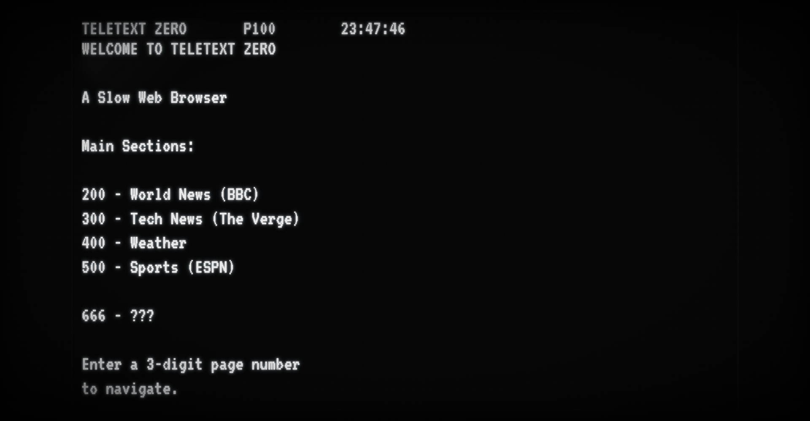

# 📺 Teletext Zero

> **Resurrecting the 1980s to cure modern information overload.**

[](https://github.com/topics/kiroween)
[](https://kiro.dev)
[](https://www.typescriptlang.org/)
[](https://reactjs.org/)

---

## 🎃 What is Teletext Zero?

Teletext Zero is a **"Slow Web" browser** that resurrects the aesthetic and technical limitations of 1980s TV Teletext systems. In an age of infinite scroll and notification overload, we're going back to basics: **40 columns, 24 rows, 8 colors, and keyboard-only navigation.**

No mouse. No links. No doom-scrolling. Just you, a glowing CRT screen, and the news—delivered one page at a time.



---

## ✨ Features

### 📐 The Grid
A strict **40×24 character constraint engine** that enforces authentic teletext limitations:
- Every character occupies exactly one grid cell
- Content is truncated, never scrolled
- Aspect ratio preserved at any screen size

### 🔢 Remote Navigation
Authentic **3-digit page dialing** just like the original teletext remotes:
- `200` - BBC World News
- `300` - Tech News (The Verge)
- `400` - Weather (with geolocation)
- `500` - ESPN Sports
- `666` - ???

Type a page number. Watch the screen clear. See the new page appear.

### 📡 Live Data
Real content from real sources, formatted for the 40-column grid:
- **BBC World News** via RSS
- **The Verge** via RSS
- **ESPN Sports** via RSS
- **Open-Meteo** weather with local forecasts

Navigate to sub-pages (201-205, 301-305, 501-505) to read full article summaries.

### 👻 The Kiroween Twist: Page 666
*Some pages should stay buried.*

Navigate to Page 666 and discover the **Ghost in the Machine**:
- Visual glitches corrupt the text
- The screen flashes dark red
- Static noise crackles through your speakers
- Stay too long, and... *it notices you*

### 📺 CRT Aesthetic
A haunted 1980s television brought back to life:
- Phosphor glow bleeding from every character
- Horizontal scanlines scrolling endlessly
- 50Hz refresh flicker
- Vignette darkening at the curved screen edges
- Dancing signal noise grain
- Chromatic aberration on the edges

---

## 🛠️ How It Was Built: The Kiro Workflow

This project showcases two complementary approaches to AI-assisted development:

### 📋 Spec-Driven Development (The Constraint Engine)

The core teletext rendering engine was built using **Kiro's Spec feature**—a structured approach to complex features:

1. **Requirements Document**: Defined 8 core requirements covering grid constraints, color palette, navigation, and transitions
2. **Design Document**: Specified 16 correctness properties that must hold true across all inputs
3. **Property-Based Testing**: Used `fast-check` to verify properties like:
   - *"For any page content, output is always exactly 40×24"*
   - *"For any color value, it must be from the 8-color palette"*
   - *"For any 3-digit input, navigation triggers correctly"*

This approach ensured the constraint engine was **mathematically correct**, not just "working for the test cases."

### 🎨 Vibe Coding (The Fun Stuff)

The CRT effects, Page 666 horror experience, and live data integration were built through **conversational iteration**:

- *"Make it look like a haunted 1980s television"* → CRT shader effects
- *"Add a Ghost in the Machine for Page 666"* → Glitch effects + audio + progressive horror
- *"Connect BBC, The Verge, and ESPN"* → RSS integration with caching

Kiro handled the implementation details while I focused on the creative vision.

---

## 🚀 Quick Start

```bash
# Clone the repository
git clone https://github.com/mdraf1/teletext-zero.git
cd teletext-zero

# Install dependencies
npm install

# Start development server
npm run dev

# Build for production
npm run build

# Run tests
npm test
```

Open [http://localhost:5173](http://localhost:5173) and start typing page numbers!

---

## 📖 Page Directory

| Page | Content | Sub-pages |
|------|---------|-----------|
| `100` | Index / Welcome | - |
| `200` | BBC World News | `201-205` Article details |
| `300` | The Verge Tech | `301-305` Article details |
| `400` | Weather Forecast | - |
| `500` | ESPN Sports | `501-505` Article details |
| `666` | ??? | *Don't stay too long* |

---

## 🏗️ Tech Stack

- **React 18** + **TypeScript** - UI framework
- **Vite** - Build tool
- **Vitest** + **fast-check** - Testing (unit + property-based)
- **CSS Custom Properties** - Theming and constraints
- **Web Audio API** - Spooky sounds
- **RSS2JSON** - Feed parsing
- **Open-Meteo** - Weather data

---

## 🎃 Kiroween Categories

This project is submitted for:

- **🧟 Resurrection**: Bringing back 1980s Teletext technology
- **🎭 Costume Contest**: The full CRT aesthetic transformation

---

## 📜 License

This project is licensed under the GNU General Public License v3.0 (GPL-3.0) — see the [LICENSE](./LICENSE) file for details.

---

## 🙏 Acknowledgments

- The BBC, ITV, and Channel 4 engineers who built the original Teletext systems
- The Ceefax and Oracle services that informed a generation
- Everyone who remembers waiting for page 302 to cycle around

---

*Built with 📺 and mass amounts of mass nostalgia for the Kiroween Hackathon*
